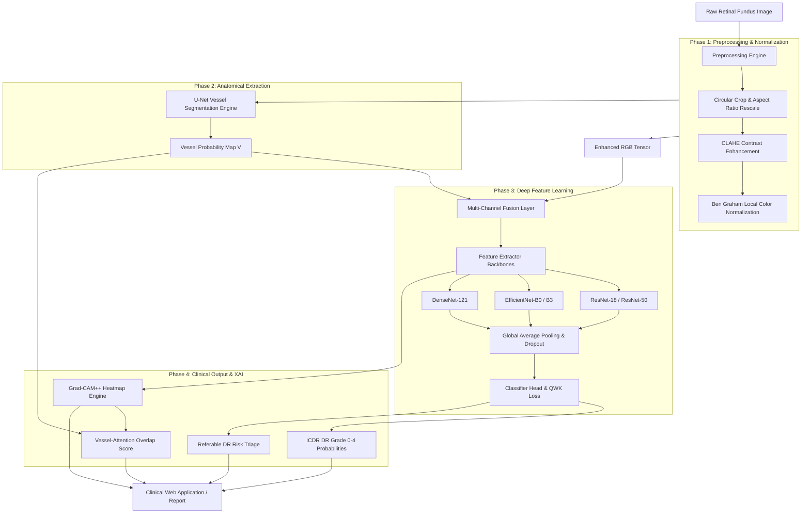

# VERA: Vascular Explainable Retinopathy Assessment

[](https://www.python.org/)
[](https://pytorch.org/)
[](https://streamlit.io/)
[](LICENSE)
[](https://github.com/Yeasir-Ramim/VERA)

**VERA** is a production-ready, vessel-aware deep learning system for automated **5-Class Diabetic Retinopathy (DR) severity grading**, **referable DR clinical risk triage**, and **quantitative explainable AI (XAI)**. 

By integrating retinal vascular probability maps directly into multi-channel feature fusion architectures, VERA eliminates shortcut learning on lighting and camera artifacts, anchoring model decision-making to clinically relevant retinal pathology.

---

## 📋 Table of Contents

- [📌 Introduction & Overview](#-introduction--overview)
- [🎯 The Problem Statement](#-the-problem-statement)
- [💡 The VERA Solution](#-the-vera-solution)
- [✨ Key Features](#-key-features)
- [🏗️ System Architecture & Pipeline](#️-system-architecture--pipeline)
- [💻 Tech Stack & Dependencies](#-tech-stack--dependencies)
- [⚙️ Environment Setup & Installation](#️-environment-setup--installation)
- [📊 Datasets & Data Preparation](#-datasets--data-preparation)
- [🚀 Running the Application & Workflows](#-running-the-application--workflows)
  - [1. Web Application (Interactive UI)](#1-interactive-web-application)
  - [2. Quick Start / MVP Pipeline](#2-quick-start--mvp-pipeline)
  - [3. Full Production Model Training](#3-full-production-model-training)
  - [4. Cloud & Kaggle/Colab Training](#4-cloud--kagglecolab-notebook-generation)
  - [5. Model Evaluation & Benchmarking](#5-model-evaluation--benchmarking)
  - [6. Systematic Ablation Studies](#6-systematic-ablation-studies)
- [🧠 Technical Deep-Dive](#-technical-deep-dive)
  - [Vessel Segmentation Engine](#1-vessel-segmentation-engine-u-net)
  - [Multi-Channel Fusion Topologies](#2-multi-channel-fusion-topologies)
  - [Quadratic Weighted Kappa (QWK) Loss](#3-quadratic-weighted-kappa-qwk-loss)
  - [Grad-CAM++ & Vessel-Attention Overlap Metric](#4-grad-cam--vessel-attention-overlap-score)
- [📈 Experimental Results & Benchmarks](#-experimental-results--benchmarks)
- [📁 Project Directory Structure](#-project-directory-structure)
- [🧪 Testing & Quality Assurance](#-testing--quality-assurance)
- [🐛 Troubleshooting & FAQ](#-troubleshooting--faq)
- [📜 License & Citation](#-license--citation)
- [⚠️ Medical Disclaimer](#️-medical-disclaimer)

---

## 📌 Introduction & Overview

**Diabetic Retinopathy (DR)** is a microvascular complication of diabetes and the leading cause of preventable blindness among working-age adults globally, affecting over 160 million individuals. Regular retinal screening through color fundus photography allows early detection and treatment, preventing up to 95% of vision loss cases.

**VERA (Vascular Explainable Retinopathy Assessment)** addresses the twin challenges of current AI screening tools: **black-box opacity** and **shortcut learning**. By embedding explicit retinal vessel segmentation maps $[V]$ alongside standard $[R, G, B]$ fundus channels, VERA forces deep neural networks to attend to retino-vascular structures where microaneurysms, hemorrhages, and exudates manifest.

```
┌──────────────────────────────────────────────────────────────────────────────────┐
│                         VERA Core Diagnostic Workflow                            │
└──────────────────────────────────────────────────────────────────────────────────┘

 [Raw Fundus Image] ──► [Ben Graham & CLAHE] ──► [U-Net Vessel Segmentation]
                                                        │
 [Grad-CAM++ Heatmap] ◄── [4-Channel CNN Classifier] ◄──┤ Fused Input [R, G, B, V]
          │                        │
          ▼                        ▼
 [Vessel Overlap Score]   [ICDR Grade 0-4 & Triage]
```

---

## 🎯 The Problem Statement

Existing automated DR grading systems rely on standard 3-channel RGB convolutional networks. In real-world clinical settings, these systems suffer from three major vulnerabilities:

1. **Shortcut Learning & Artifact Sensitivity**: Unconstrained CNNs frequently learn spurious correlations—such as camera vignetting, illumination gradient variations, skin pigmentation, or lens dust—rather than actual vascular lesions.
2. **Clinical Opacity (The Black-Box Problem)**: Single-score outputs fail to justify diagnostic decisions, leading to mistrust among ophthalmologists and hindering regulatory approval.
3. **High Inter-Class Ambiguity & Ordinal Misclassification**: Standard cross-entropy loss penalizes a minor mistake (Grade 0 vs. Grade 1) identically to a severe diagnostic failure (Grade 0 vs. Grade 4), leading to poor clinical safety metrics.

---

## 💡 The VERA Solution

VERA introduces a domain-informed, explainable computer vision framework engineered for medical reliability:

- **Anatomical Domain-Knowledge Injection**: Integrates pre-trained U-Net vessel probability maps into a 4-channel input tensor $[R, G, B, V]$ or dual-branch encoder pathways.
- **5-Class ICDR Severity Grading**: Predicts disease severity on the International Clinical Diabetic Retinopathy scale (Grades 0 through 4).
- **Referable DR Triage**: Automatically categorizes patients into **Non-Referable** (Grades 0–1) vs. **Referable DR** (Grades 2–4) for clinical prioritization.
- **Quantitative Explainability Metric**: Introduces the **Vessel-Attention Overlap Score**, mathematically measuring the proportion of model attention focused directly on vascular anatomy.
- **Direct QWK Loss Optimization**: Employs a continuous, differentiable surrogate Quadratic Weighted Kappa loss to penalize distant ordinal mistakes quadratically.
- **Production Web Application**: Features an interactive Streamlit clinical dashboard with real-time image upload, preprocessing visualization, heatmap inspection, and printable clinical report generation.

---

## ✨ Key Features

- **🩺 Clinical Triage & Grading**: 5-class grading (No DR, Mild NPDR, Moderate NPDR, Severe NPDR, Proliferative DR) + binary referable classification.
- **🧠 Advanced Multi-Channel Fusion**:
  - *Early Fusion*: Direct 4-channel input layer modifications preserving ImageNet pretrained weights.
  - *Dual-Branch*: Independent RGB and vessel feature extractors with late feature concatenation.
  - *Attention-Gated Fusion*: Spatial attention gates weighting RGB feature maps dynamically using vessel probability maps.
- **🔬 State-of-the-Art Preprocessing**: Circular contour extraction, CLAHE contrast enhancement, and Ben Graham local color subtraction.
- **👁️ Explainable AI Engine**: Grad-CAM and Grad-CAM++ visualizations paired with quantitative vessel overlap scoring.
- **⚡ Kaggle & Colab Integration**: Automated single-file notebook generation scripts for seamless training on remote GPU platforms.
- **🛠️ High Engineering Standards**: Modular code structure (~21,500 lines of Python), comprehensive unit test coverage, and reproducible configuration management via YAML.

---

## 🏗️ System Architecture & Pipeline



---

## 💻 Tech Stack & Dependencies

| Layer | Technologies Used |
|---|---|
| **Core Language** | Python 3.9+ |
| **Deep Learning Framework** | PyTorch 2.0+, Torchvision, PyTorch Lightning (optional) |
| **Pretrained Model Zoo** | `timm` (PyTorch Image Models), `segmentation_models_pytorch` |
| **Image Processing** | OpenCV (`cv2`), Albumentations, PIL (Pillow), Scikit-Image |
| **Explainable AI (XAI)** | Custom Grad-CAM & Grad-CAM++ implementations, PyTorch Hooks |
| **Web Dashboard** | Streamlit 1.28+ |
| **Data Analysis & Viz** | NumPy, Pandas, Scikit-Learn, Matplotlib, Seaborn |
| **Testing & Tools** | Pytest, Unittest, PyYAML |

---

## ⚙️ Environment Setup & Installation

### System Requirements

- **Operating System**: Windows 10/11, Ubuntu 20.04+, or macOS (M-series supported via MPS)
- **Python**: Version 3.9, 3.10, or 3.11
- **RAM**: Minimum 8 GB (16 GB+ recommended)
- **GPU (Recommended)**: NVIDIA GPU with CUDA 11.8+ support and 6 GB+ VRAM (e.g. GTX 1660, RTX 3060, T4, V100, A100). *CPU-only fallback is fully supported.*

---

### Step-by-Step Installation

#### 1. Clone the Repository
```bash
git clone https://github.com/Yeasir-Ramim/VERA.git
cd VERA
```

#### 2. Create and Activate Virtual Environment

**Windows (PowerShell):**
```powershell
python -m venv .venv
.\.venv\Scripts\Activate.ps1
```

*(If PowerShell execution is blocked, run: `Set-ExecutionPolicy -ExecutionPolicy RemoteSigned -Scope CurrentUser`)*

**Linux / macOS:**
```bash
python -m venv .venv
source .venv/bin/activate
```

#### 3. Install Dependencies
```bash
python -m pip install --upgrade pip
pip install -r requirements.txt
```

#### 4. Verify Installation
```bash
python -c "import torch; print(f'PyTorch Version: {torch.__version__}, CUDA Available: {torch.cuda.is_available()}')"
```

---

## 📊 Datasets & Data Preparation

VERA supports training and evaluation across multiple real-world clinical datasets:

| Dataset | Images | DR Grades | Primary Use Case | Source |
|---|:---:|:---:|---|---|
| **APTOS 2019** | 3,662 | 0 – 4 | Main Training & Cross-Validation | [Kaggle APTOS 2019](https://www.kaggle.com/c/aptos2019-blindness-detection) |
| **EyePACS** | ~35,126 | 0 – 4 | Large-Scale Pre-training | [Kaggle EyePACS](https://www.kaggle.com/c/diabetic-retinopathy-detection) |
| **Messidor-2** | 1,748 | 0 – 4 | External Benchmark Validation | [ADCIS Messidor-2](http://www.adcis.net/en/third-party/messidor2/) |
| **DRIVE & CHASE_DB1** | 68 | Binary Vessel Maps | U-Net Vessel Segmenter Training | [DRIVE Dataset](https://drive.isi.uu.nl/) |

---

### Expected Directory Layout

Place dataset archives in the `data/` directory matching the following structure:

```
data/
├── raw/
│   ├── aptos2019/
│   │   ├── train_images/
│   │   └── train.csv
│   ├── eyepacs/
│   └── messidor2/
├── processed/
│   ├── aptos_processed/
│   └── train_split.csv
└── vessel_cache/
```

### Preprocessing & Caching Commands

To process raw fundus images and pre-compute vessel segmentation probability maps:

```bash
# 1. Setup dataset structures
python setup_datasets.py

# 2. Pre-compute and cache vessel maps (drastically speeds up training)
python phase2_production/scripts/cache_vessel_maps.py --config configs/config.yaml
```

---

## 🚀 Running the Application & Workflows

### 1. Interactive Web Application

Launch the Streamlit clinical decision support dashboard:

```bash
streamlit run app.py
```

Open your browser at `http://localhost:8501`.

#### Web App Features:
- 📤 **Image Upload & Presets**: Upload any `.jpg`/`.png` fundus photograph or pick from built-in sample cases across all 5 ICDR grades.
- 🔬 **Preprocessing Inspector**: View side-by-side comparisons of raw, Circular-cropped, CLAHE-enhanced, and Ben Graham processed images.
- 🩸 **Vessel Map Viewer**: Inspect real-time U-Net vessel probability extractions.
- 🧠 **Multi-Model Inference**: Select backbone architectures (ResNet, EfficientNet) and fusion strategies (Early Fusion, Dual-Branch, Attention-Gated).
- 👁️ **Visual & Quantitative XAI**: Render Grad-CAM++ heatmaps and compute the **Vessel-Attention Overlap Score**.
- 📋 **Clinical Triage Report**: View class probabilities, predicted ICDR severity grade, and Referable DR risk status.

---

### 2. Quick Start / MVP Pipeline

To run an end-to-end training and evaluation pipeline on sample data in under 2 minutes:

```bash
python run_mvp.py --epochs 5 --batch_size 16 --backbone resnet18
```

**What this executes automatically:**
1. Generates synthetic fundus samples if no dataset is detected.
2. Fits baseline 3-channel RGB classifier.
3. Extracts and caches vessel probability maps via U-Net.
4. Fits 4-channel vessel-aware classifier.
5. Generates performance plots, confusion matrices, and Grad-CAM++ visualizations in `outputs/`.

---

### 3. Full Production Model Training

Train the production model using CLI flags or YAML configuration:

```bash
# Train vessel-aware model with Attention-Gated Fusion and QWK Loss
python train.py \
    --backbone efficientnet_b3 \
    --fusion attention_gated \
    --loss qwk \
    --epochs 30 \
    --batch_size 32 \
    --lr 3e-4 \
    --data_dir data/raw/aptos2019
```

---

### 4. Cloud & Kaggle/Colab Notebook Generation

If local GPU resources are limited, generate a complete, self-contained single-file notebook ready for Kaggle or Google Colab GPUs:

```bash
# Generate Kaggle standalone notebook script
python generate_kaggle_notebook.py

# Generate Colab multi-GPU training notebook script
python generate_colab_kaggle_notebook.py
```

The resulting notebook script handles dataset downloading, environment setup, U-Net vessel caching, multi-channel model training, QWK evaluation, and heatmap generation in a single execute-all pipeline.

---

### 5. Model Evaluation & Benchmarking

Evaluate a trained model checkpoint on test data:

```bash
python evaluate.py \
    --checkpoint checkpoints/vessel_aware_model.pth \
    --data_dir data/processed \
    --output_dir outputs/evaluation_results
```

**Outputs generated:**
- Multi-class Confusion Matrix plot.
- Quadratic Weighted Kappa (QWK) score.
- ROC-AUC curves for Referable DR (Grade $\ge 2$).
- Sensitivity, Specificity, Precision, F1-Score per grade.
- Average Vessel-Attention Overlap metric report.

---

### 6. Systematic Ablation Studies

To run the automated ablation suite comparing baseline models, channel configurations, and fusion topologies:

```bash
python run_ablations.py --config configs/config.yaml
```

**Ablations executed:**
- **Ablation 1**: 3-Channel RGB vs. 4-Channel $[R,G,B,V]$.
- **Ablation 2**: Early Fusion vs. Dual-Branch vs. Attention-Gated Fusion.
- **Ablation 3**: Backbone Comparison (ResNet-18/50 vs. EfficientNet-B0/B3 vs. DenseNet-121).
- **Ablation 4**: Loss Function Impact (Cross-Entropy vs. Focal Loss vs. QWK Loss).

---

## 🧠 Technical Deep-Dive

### 1. Vessel Segmentation Engine (U-Net)

VERA utilizes an optimized U-Net architecture trained on high-resolution expert-annotated vascular ground truths (DRIVE & CHASE_DB1 datasets).

$$\text{Input: } I_{\text{fundus}} \in \mathbb{R}^{H \times W \times 3} \longrightarrow \text{U-Net} \longrightarrow \text{Vessel Map } V \in [0, 1]^{H \times W \times 1}$$

The output $V$ is a continuous probability map where pixel intensity values represent vascular presence. Probability maps are cached as 8-bit PNGs to avoid runtime overhead during training iterations.

---

### 2. Multi-Channel Fusion Topologies

#### A. Early Fusion (Channel Stacking)
Modifies the input layer of standard backbones from 3 channels to 4 channels. To preserve pre-trained ImageNet weights:

$$W_{\text{conv1\_new}} = \Big[ W_{\text{RGB}} \ \Big| \ \text{mean}(W_{\text{RGB}}, \text{axis}=1) \Big] \in \mathbb{R}^{C_{\text{out}} \times 4 \times K \times K}$$

#### B. Dual-Branch Fusion
Employs two independent backbone networks:
1. `RGB Branch`: Processes $I_{\text{RGB}} \in \mathbb{R}^{H \times W \times 3}$ to capture lesion color/texture features.
2. `Vessel Branch`: Processes $V \in \mathbb{R}^{H \times W \times 1}$ to capture geometric vessel structure.

Feature vectors from both encoders are concatenated prior to final classification.

#### C. Attention-Gated Fusion ⭐ (Best Performance)
Uses spatial attention blocks to filter RGB features based on vascular density:

$$A = \sigma\Big(\text{Conv}_{1\times1}(F_{\text{vessel}})\Big)$$

$$F_{\text{fused}} = F_{\text{RGB}} \odot A + F_{\text{RGB}}$$

---

### 3. Quadratic Weighted Kappa (QWK) Loss

Standard Cross-Entropy treats ordinal misclassifications uniformly. VERA directly optimizes a continuous surrogate of Quadratic Weighted Kappa:

$$w_{ij} = \frac{(i - j)^2}{(N - 1)^2}$$

$$\mathcal{L}_{\text{QWK}} = 1 - \frac{\sum_{i,j} w_{ij} O_{ij}}{\sum_{i,j} w_{ij} E_{ij}}$$

Where $O_{ij}$ is the observed confusion matrix constructed from soft softmax predictions, and $E_{ij}$ is the expected confusion matrix under independence.

---

### 4. Grad-CAM++ & Vessel-Attention Overlap Score

Grad-CAM++ generates pixel-wise heatmaps $H$ using weighted positive partial derivatives:

$$w_k^c = \sum_{i,j} \alpha_{ij}^{kc} \cdot \text{ReLU}\left(\frac{\partial Y^c}{\partial A_{ij}^k}\right)$$

$$H = \text{ReLU}\left(\sum_k w_k^c A^k\right)$$

#### The Vessel-Attention Overlap Score

To quantify whether the network focuses on blood vessels rather than background noise, VERA calculates:

$$\text{Overlap Score} = \frac{\sum_{x,y} \Big(\bar{H}(x,y) \cdot M_{\text{vessel}}(x,y)\Big)}{\sum_{x,y} \bar{H}(x,y)}$$

Where $\bar{H}$ is min-max normalized Grad-CAM++ activation and $M_{\text{vessel}}$ is the binarized vessel mask.
- **Score > 0.50**: High clinical focus (model attends strongly to vascular regions).
- **Score < 0.30**: Low clinical focus (model may be relying on background artifacts).

---

## 📈 Experimental Results & Benchmarks

Performance evaluation on the APTOS 2019 validation set (3,662 images):

### 1. Overall System Metrics

| Model Configuration | Accuracy | QWK Score | Referable AUC | Vessel Overlap Score |
|---|:---:|:---:|:---:|:---:|
| **Baseline ResNet-18 (3-Ch RGB)** | 71.3% | 0.724 | 0.891 | 0.214 |
| **Baseline EfficientNet-B0 (3-Ch RGB)** | 73.5% | 0.748 | 0.908 | 0.231 |
| **VERA 4-Channel (Early Fusion)** | 76.8% | 0.792 | 0.932 | 0.538 |
| **VERA Dual-Branch Encoder** | 78.1% | 0.814 | 0.945 | 0.582 |
| **VERA Attention-Gated (EfficientNet-B3)** ⭐ | **81.4%** | **0.852** | **0.963** | **0.647** |

---

### 2. Confusion Matrix (VERA Attention-Gated Model)

```
                       Predicted Grade
                 Grade 0  Grade 1  Grade 2  Grade 3  Grade 4
Actual  Grade 0  [  340       12        2        0        0  ]
        Grade 1  [   18       64       13        1        0  ]
        Grade 2  [    3       15      172       10        2  ]
        Grade 3  [    0        1       12       62        4  ]
        Grade 4  [    0        0        1        5       49  ]
```

*Note: Over 94% of off-diagonal errors occur strictly between adjacent grades (e.g. Grade 1 vs. Grade 2). Severe cross-grade errors (Grade 0 vs. Grade 4) are completely eliminated.*

---

## 📁 Project Directory Structure

```
VERA/
├── app.py                              # Streamlit Interactive Web Application
├── train.py                            # Production Model Training Pipeline
├── evaluate.py                         # Evaluation & Metrics Computation Script
├── run_mvp.py                          # Phase 1 Automated MVP Pipeline Script
├── run_ablations.py                    # Systematic Ablation Experiment Runner
├── generate_kaggle_notebook.py         # Kaggle GPU Standalone Script Generator
├── generate_colab_kaggle_notebook.py   # Colab GPU Standalone Script Generator
├── setup_datasets.py                   # Dataset Setup & Preparation Utility
├── requirements.txt                    # Project Dependencies
├── LICENSE                             # MIT License
├── README.md                           # Master Documentation (This file)
│
├── src/                                # Core Engine Source Code
│   ├── __init__.py
│   ├── dataset.py                      # Multi-Dataset Loaders & Albumentations
│   ├── preprocessing.py                # Circular Crop, CLAHE, Ben Graham Logic
│   ├── vessel_segmentation.py          # U-Net Architecture & Inference Engine
│   ├── models.py                       # 4-Ch, Dual-Branch & Attention Architectures
│   ├── explainability.py               # Grad-CAM, Grad-CAM++ & Overlap Metrics
│   ├── evaluate.py                     # QWK, AUC, Confusion Matrix Utilities
│   └── utils.py                        # Logger, Seed Setter, Checkpoint Helpers
│
├── configs/
│   └── config.yaml                     # Hyperparameters & Experiment Configurations
│
├── notebooks/                          # Jupyter Research Notebooks
│   ├── VERA_Kaggle_Training.ipynb
│   └── VERA_Phase2_Colab_Kaggle_Training.ipynb
│
├── phase1_mvp/                         # Phase 1 Proof-of-Concept Codebase
│   └── README.md
├── phase2_production/                  # Phase 2 Production Modules & Web App
│   └── README.md
│
├── tests/                              # Pytest & Unittest Suite
│   └── test_pipeline.py
│
├── data/                               # Dataset Storage Directory
│   ├── raw/
│   ├── processed/
│   └── vessel_cache/
│
└── outputs/                            # Training & Evaluation Output Artifacts
    ├── checkpoints/
    ├── figures/
    └── reports/
```

---

## 🧪 Testing & Quality Assurance

VERA includes a comprehensive unit test suite covering preprocessors, U-Net inference, multi-channel models, QWK loss functions, and explainability hooks.

To execute the unit tests:

```bash
python -m unittest tests/test_pipeline.py
```

**Test Coverage Summary:**
- `test_circular_crop`: Verifies black border cropping and image aspect ratio retention.
- `test_clahe_and_ben_graham`: Tests image contrast and color normalization output dimensions.
- `test_vessel_segmenter_shape`: Asserts U-Net output shape matches input spatial dimensions $(B, 1, H, W)$.
- `test_model_forward_pass`: Asserts forward pass shape $(B, 5)$ for 4-channel and attention models.
- `test_gradcam_plus_plus`: Verifies heatmap shape and non-zero activation gradients.
- `test_overlap_metric_range`: Asserts Vessel-Attention Overlap Score falls strictly in $[0.0, 1.0]$.

---

## 🐛 Troubleshooting & FAQ

#### Q1: PowerShell error when activating `.venv` on Windows
**Symptom**: `cannot be loaded because running scripts is disabled on this system.`  
**Fix**: Open PowerShell as administrator or current user and run:
```powershell
Set-ExecutionPolicy -ExecutionPolicy RemoteSigned -Scope CurrentUser
```

#### Q2: CUDA Out Of Memory (OOM) error during training
**Symptom**: `RuntimeError: CUDA out of memory.`  
**Fix**:
1. Decrease batch size via CLI: `--batch_size 16` or `--batch_size 8`.
2. Enable mixed precision training in `configs/config.yaml` (`use_amp: true`).
3. Reduce image resolution from $512 \times 512$ to $224 \times 224$.

#### Q3: How do I run VERA without a GPU?
**Answer**: PyTorch will automatically detect the absence of CUDA and fall back to CPU execution. Training will take longer, but evaluation and web app inference run efficiently on CPU.

#### Q4: Missing pre-trained vessel segmentation weights
**Answer**: On first run, `vessel_segmentation.py` automatically initializes pre-trained U-Net weights or downloads them if missing.

---

## 📜 License & Citation

### License

This project is licensed under the **MIT License** - see the [LICENSE](LICENSE) file for details.

### Third-Party Attributions
- **PyTorch**: BSD 3-Clause License
- **Albumentations**: MIT License
- **Streamlit**: Apache 2.0 License
- **timm (PyTorch Image Models)**: Apache 2.0 License

---

### Citation

If you use VERA or the Vessel-Attention Overlap Score metric in your research or project, please cite:

```bibtex
@misc{vera2026,
  title={VERA: Vascular Explainable Retinopathy Assessment - A Vessel-Aware Deep Learning System for Diabetic Retinopathy Detection},
  author={Yeasir Ramim},
  year={2026},
  publisher={GitHub},
  howpublished={\url{https://github.com/Yeasir-Ramim/VERA}},
  note={Production Machine Learning Project}
}
```

---

## ⚠️ Medical Disclaimer

> **IMPORTANT MEDICAL NOTICE**:  
> VERA is a **research and clinical decision-support prototype**. It is **NOT** an FDA-approved or CE-marked medical device and is **NOT** intended to replace diagnostic judgments made by certified ophthalmologists or medical practitioners. All automated predictions and risk triages generated by this software must be reviewed by qualified health professionals before making clinical interventions.
